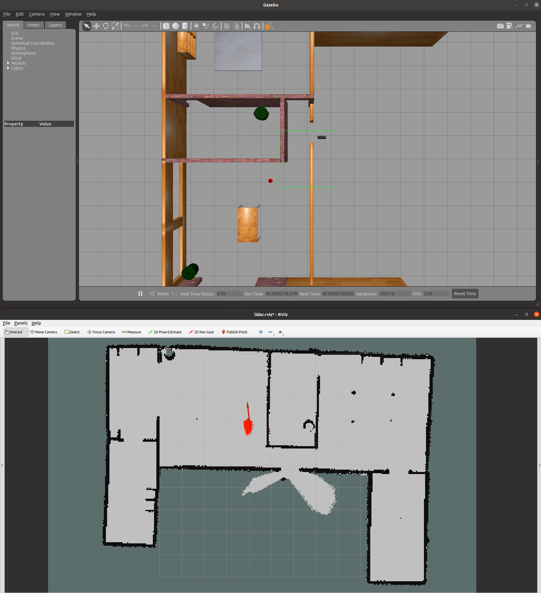

# CS 603 Particle Filter
This package contains the CS 603 Particle Filter package. 

## Installation

### Install ROS Noetic
Follow the instructions to install ROS Noetic for Ubuntu 20.04 at: http://wiki.ros.org/noetic/Installation/Ubuntu. Please install the ros-noetic-desktop-full version

### Install Other ROS Dependencies
```bash
sudo apt install ros-noetic-gazebo-ros-pkgs ros-noetic-depthimage-to-laserscan ros-noetic-gmapping python3-catkin-tools python3-pip ros-noetic-map-server
pip3 install pynput
```

### Create a Catkin Workspace (if none exists)
Follow the instructions at: https://wiki.ros.org/catkin/Tutorials/create_a_workspace

```bash
mkdir -p ~/catkin_ws/src
cd ~/catkin_ws/
catkin_make
```

### Install the Turtlebot3 Simulation Package (for the Gazebo Simulation Environment)
Follow the installation instructions at: https://emanual.robotis.com/docs/en/platform/turtlebot3/quick-start/ (sections 3.1.3 and 3.1.4 for Noetic) first to install Turtlebot3 dependencies (if they have not yet been previously installed). 

Next, download and install the `turtlebot3_simulations` package to your catkin workspace: 

```bash
cd ~/catkin_ws/src/
git clone -b noetic-devel https://github.com/ROBOTIS-GIT/turtlebot3_simulations.git
cd ~/catkin_ws
catkin_make
```

Make sure that you are able to clone and successfully compile `turtlebot3_simulations` as the gazebo world will come from this package. 


### Download and Install the CS 603 Particle Filter Repository
```bash
cd ~/catkin_ws/src
git clone https://gitlab.com/HCRLab/stingray-robotics/cs603_particle_filter.git
cd ~/catkin_ws
catkin_make
```

## Running the Simulation

### Generate Map Using GMapping (SLAM)
To generate the map, you must launch the `triton_gmapping.launch` file then move the triton robot around using the teleop file. For more information, you can refer to the turtlebot3_slam page (https://emanual.robotis.com/docs/en/platform/turtlebot3/slam_simulation/) which is similar but uses a different robot. 

```bash
cd ~/catkin_ws
source devel/setup.bash
roslaunch cs603_particle_filter triton_gmapping.launch
```

### Robot Teleoperation (important note)

In order for the robot to perform SLAM to generate the map, you may move the robot manually using the `teleop_particle_filter.py` script in the `cs603_particle_filter` package. 

On a separate terminal, run: 
```bash
rosrun cs603_particle_filter teleop_particle_filter.py
```

__NOTE__: this teleop file has forward direction along the __+x-axis__ in order to be consistent with the standard ROS SLAM conventions as well as with the motion model equations. This is different from the previously released `stingray_sim` `teleop_robot.py` where the forward direction is along the _+y-axis_. 

Also note that even if the `teleop_particle_filter.py` package allows for omnidirectional movement because the Triton robot supports it, the motion model discussed in class is for a differential drive robot only. 

### Save the Map

After you have a complete map, save it using the `map_server` package:
```bash
rosrun map_server map_saver -f ~/map
```

### Generate the Metric Map and Likelihood Field

Once you have the map, you can use it to generate the metric map that will be used for the sensor model. You can implement your code directly in the file `scripts/generate_likelihood_field.py`. This script should generate a  metric map and/or likelihood field that you will use in your sensor model for the particle filtering. 


## Particle Filter

To run the particle filter simulation environment: 
```bash
cd ~/catkin_ws
source devel/setup.bash
roslaunch cs603_particle_filter particle_filter.launch
```

Gazebo and RViz will also automatically launch, as well as some helper nodes for the necessary TF transforms and robot odometry. To visualize the particles, you can add a `PoseArray` display to the RViz window to visualize the particles you generate. You can also visualize the position of the robot by adding a `Pose` or `Odometry` display to the RViz window. You can also visualize the map by adding a `Map` display to the RViz window. Search the RViz documentation to learn more about `PoseArray`, `Map`, and `Odometry`. 

You can implement your code for the particle filter directly in the file `scripts/particle_filter.py`. 



